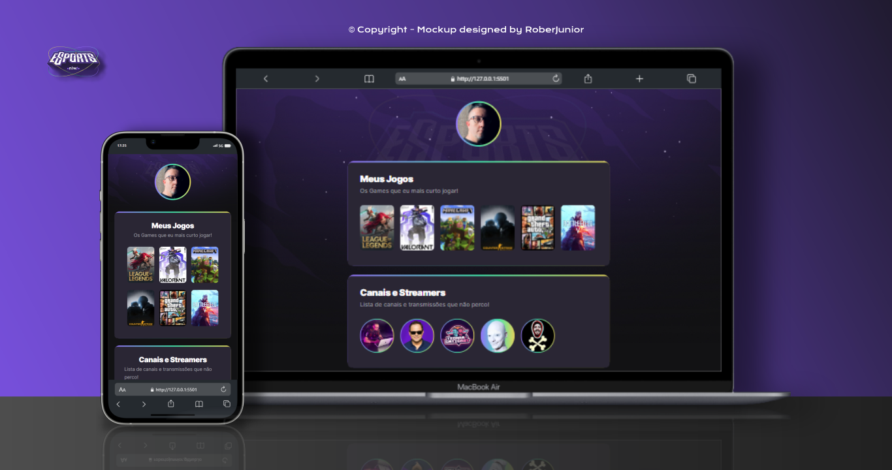

<h1 align="center"> NLW e-Sports </h1>

Projeto realizado com a participação na semana NLW e-Sports <a href="https://www.rocketseat.com.br/">"Rocketseat"</a> com o instrutor Mayk Brito!  

  <a href="#-tecnologias">Tecnologias</a>&nbsp;&nbsp;&nbsp;|&nbsp;&nbsp;&nbsp;
  <a href="#-projeto">Projeto</a>&nbsp;&nbsp;&nbsp;|&nbsp;&nbsp;&nbsp;
  <a href="#-layout">Layout</a>&nbsp;&nbsp;&nbsp;|&nbsp;&nbsp;&nbsp;
  <a href="#memo-licença">Licença</a>

  

 

  

    
  

 
 
 

## 🚀 Tecnologias

Esse projeto está sendo desenvolvido com as seguintes tecnologias:

<li> HTML
<li> CSS
<li> GitHub

## 💻 Projeto

Dentro dos assuntos do vídeo, o instrutor Mayk Brito fala também de temas como Responsividade, HTML semântico, Flexbox e Grid.

[Visite o projeto online](https://robertojunnior.github.io/nlw_e_sports/)🧑‍🚀

## 🔖 Layout

Todo o layout foi criado pela Rocktseat e demonstrado pelo instrutor Mayk Brito.

## :memo: Licença

Esse projeto está sob a licença MIT.

---

Feito com ♥ by Roberto Junior 😁:wave: 
 🧑‍🚀[Inscreva-se no canal do YouTube da ROCKETSEAT!](https://www.youtube.com/rocketseat)

    
<h4> Obrigado por visitar meu Git e se chegou até aqui dê um "follow" que retribuo, quem sabe não podemos colaborar em algum projeto juntos? 
 
 To the next! 🚀🧑‍🚀👽😁🖖.
